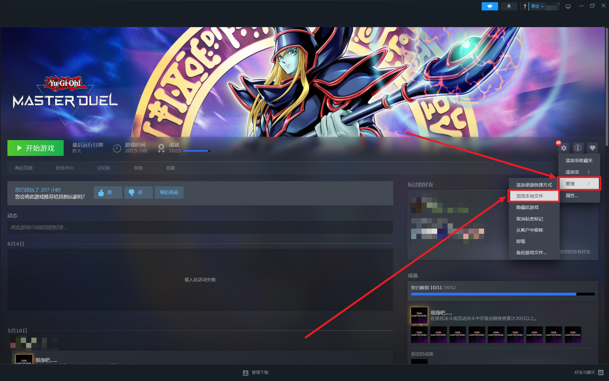
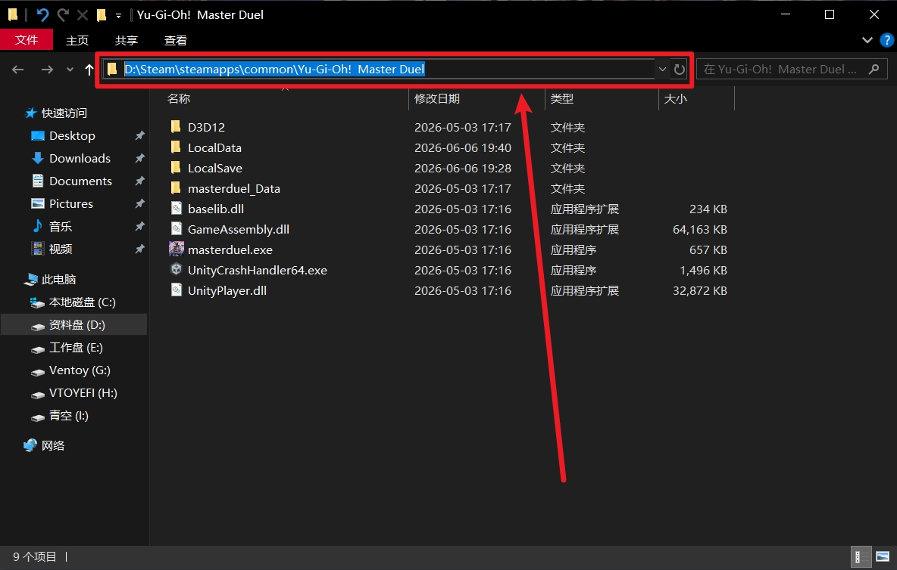
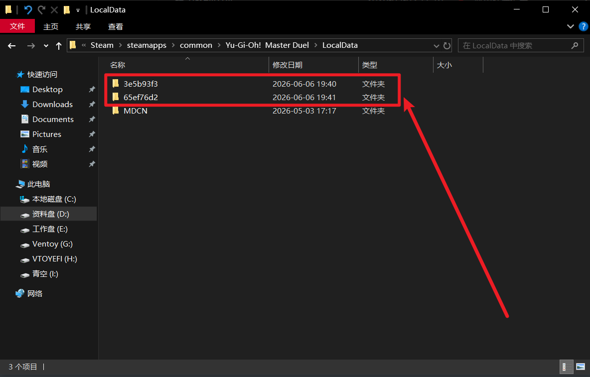

# 文档

## md文件路径

指的是游戏王md**在你电脑上的**具体文件路径

如何寻找：**Steam**->**库**->**Yu-Gi-Oh!  Master Duel**->**设置**->**管理**->**浏览本地文件**

Ctrl+A全选，Ctrl+C复制**地址栏**的地址

Ctrl+V粘贴到**操作区第一项**

## 登录账号编码

根据上一项，进入LocalData文件夹，这里的一个编码文件夹就对应一个账号

有**10G+**文件的**文件夹**就是你的**原始文件**，你可以将其**重命名**为**MDCN**

每当你登录一个账号，这里就会生成**对应的**编码文件夹

然后你需要把生成的**新文件夹里的**0000文件夹删除，把编码填入**操作区第二项**

## 原始文件编码

如果你在上一项已经重命名为MDCN，就不用填写

如果你**没有重命名**，请将对应编码填入**操作区第三项**